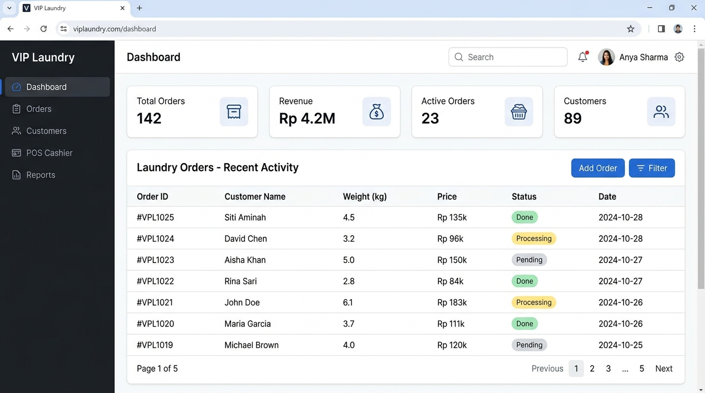

# VIP Laundry — Laundry Management & POS System

> A premium web-based laundry management system with a POS cashier, location tracking, and admin analytics dashboard.

[]()
[]()
[]()
[](LICENSE)

---

## About The Project

VIP Laundry is a comprehensive management system built for small-to-medium laundry businesses. It covers everything from customer order management to cashier operations, making it easier for business owners to manage their day-to-day operations digitally.

---

## Screenshots

**Admin Dashboard**


---

## Features

- **Admin Dashboard** — Overview of orders, revenue, and customer stats
- **POS Cashier** — Weight-based price calculator with instant receipt generation
- **Order Management** — Create, track, and update laundry order status
- **Customer Database** — Track customer history and contacts
- **OpenStreetMap Integration** — Display business location and delivery zones on an interactive map
- **PDF Receipt Export** — Generate and print professional receipts
- **Role-Based Access** — Admin and Cashier roles with separate permissions

---

## Tech Stack

| Layer | Technology |
|:---|:---|
| Backend | Laravel 12 (PHP) |
| Frontend | Blade Templates, Alpine.js |
| Styling | Tailwind CSS |
| Maps | OpenStreetMap / Leaflet.js API |
| Database | MySQL |
| Dev Tools | Composer, NPM, Vite |

---

## Folder Structure

```
app-laundry/
├── app/
│   ├── Http/
│   │   ├── Controllers/    # Request handlers (Admin, Cashier, etc.)
│   │   └── Middleware/     # Auth & role middleware
│   └── Models/             # Eloquent ORM models
├── database/
│   ├── migrations/         # DB schema definitions
│   └── seeders/            # Sample data seeders
├── resources/
│   └── views/              # Blade template files
│       ├── admin/          # Admin panel views
│       └── cashier/        # POS cashier views
├── routes/
│   └── web.php             # Route definitions
├── public/                 # Entry point & static assets
└── screenshots/            # Project screenshots
```

---

## Getting Started

### Prerequisites

- PHP 8.2+
- Composer
- Node.js 18+
- MySQL 8.0+

### Installation

**1. Clone the repository**
```bash
git clone https://github.com/Abdul-anip/app-laundry.git
cd app-laundry
```

**2. Install dependencies**
```bash
composer install
npm install
```

**3. Environment setup**
```bash
cp .env.example .env
php artisan key:generate
```

**4. Configure database** in `.env`:
```env
DB_DATABASE=laundry_db
DB_USERNAME=root
DB_PASSWORD=your_password
```

**5. Run migrations & seeders**
```bash
php artisan migrate --seed
```

**6. Build frontend & start server**
```bash
npm run dev
php artisan serve
```

**7. Access the app**

Open [http://localhost:8000](http://localhost:8000) and login with the seeded admin credentials.

---

## License

Distributed under the MIT License. See [LICENSE](LICENSE) for more information.

---

## Author

**Abdul Hanif** — D4 Software Engineering Technology, Politeknik Negeri Padang

[](https://abdul-anip.github.io/CV/)
[](https://linkedin.com/in/abdul-hanif-78649b331)
